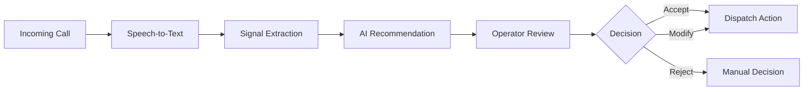
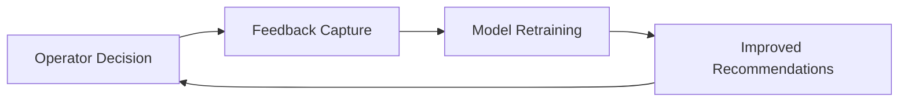
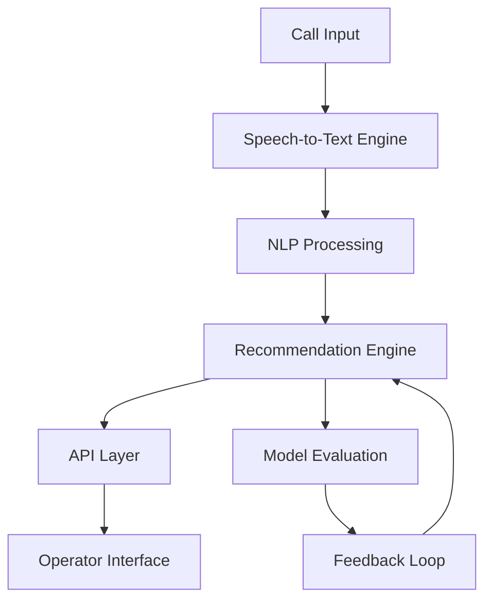

# AI Agent Assist Platform for Emergency Response
End-to-End Product Design | Real-Time Decision Support System

## Problem

Emergency response operators must make critical decisions within seconds, often with incomplete and noisy information.

Key challenges:
- High cognitive load during live calls
- Delays in identifying critical signals
- Risk of incorrect or inconsistent decisions
- Lack of intelligent decision support systems

## Solution

An AI-powered agent assist platform that:

- Transcribes calls in real time
- Extracts critical signals (keywords, severity, intent)
- Recommends next-best actions
- Provides confidence and explanation
- Keeps human operators in control of final decisions

Goal: Augment human decision-making, not replace it.

## Product Vision

Enable faster, more accurate, and consistent emergency response decisions through real-time AI assistance.

## North Star Metric

AI-Assisted Decision Rate  
(% of emergency decisions supported by AI recommendations)

## Key Supporting Metrics

| Metric                      | Target        |
|---------------------------|--------------|
| Decision Time Reduction   | 25–40%       |
| Recommendation Recall     | > 90%        |
| Agent Adoption Rate       | > 70%        |
| Override Rate             | < 25%        |
| System Latency            | < 2 seconds  |

## Users

| User        | Needs                                  |
|-------------|----------------------------------------|
| Operator    | Fast and reliable decision support     |
| Supervisor  | Visibility and quality control         |
| Organization| Consistency and compliance             |

## User Workflow

## MVP Scope

| Included                     | Not Included                  |
|----------------------------|-------------------------------|
| Real-time transcription     | Full automation               |
| AI recommendations          | Personalization               |
| Confidence scoring          | Cross-agency integration      |
| Human-in-the-loop decisions | Predictive analytics          |

## Roadmap

| Phase        | Focus                                      |
|--------------|--------------------------------------------|
| Now (0 → 1)  | MVP decision support and pilot rollout      |
| Next (1 → 10)| ML improvements and feedback loop           |
| Later (10 → 100) | Predictive insights and scale           |

## AI Product Design

Approach:
- Hybrid system combining rule-based logic and machine learning
- Designed for reliability, explainability, and continuous learning

## Key Tradeoffs

| Tradeoff                  | Decision                                      |
|--------------------------|-----------------------------------------------|
| Accuracy vs Latency      | Prioritize low latency for real-time use      |
| Automation vs Trust      | Keep human-in-the-loop                        |
| Recall vs Precision      | Favor higher recall to avoid missed cases     |
| Complexity vs Explainability | Use hybrid model for transparency        |

## AI Evaluation

| Metric     | Purpose                                |
|------------|----------------------------------------|
| Recall     | Ensure critical cases are not missed   |
| Precision  | Limit unnecessary alerts               |
| Latency    | Maintain real-time usability           |
| Override Rate | Measure user trust                  |

## Learning Loop

## System Overview

## Trust, Safety, and Compliance

- Human decision-making remains final
- Recommendations are transparent and explainable
- System performance monitored across different user groups
- Full audit logging for decisions and overrides
- Designed for high-stakes and regulated environments

## Experimentation Strategy

A/B Testing:

| Group | Experience           |
|------|---------------------|
| A    | No AI assistance     |
| B    | AI-assisted workflow |

Evaluation:
- Decision time
- Accuracy
- User adoption and satisfaction

## Launch Strategy

| Phase   | Plan                                |
|---------|-------------------------------------|
| Pilot   | Limited rollout (20–30 operators)   |
| Expand  | Improve performance and scale usage |
| Scale   | Organization-wide deployment        |

## Key Product Decisions

- Prioritized decision support over automation
- Optimized for low latency in real-time workflows
- Focused on building trust through transparency
- Designed for reliability in mission-critical environments

## Summary

This project demonstrates:
- Product strategy and roadmap ownership
- AI-driven decision system design
- Real-time system thinking
- Metrics-driven decision-making
- Strong focus on trust, safety, and usability

